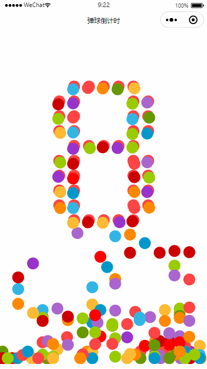

## 小程序：taro + canvas 绘制弹球倒计时组件

### 0. 效果图



### 1. [taro](https://taro-docs.jd.com/taro/docs/README)

**Taro** 是京东开发的一个开放式跨端跨框架解决方案。为啥用taro，因为没用过vue，用react写的话也就能用taro，说实话还挺好用的，只搞小程序的话也是不错的选择。

### 2.框架 安装

##### 2.1 首先全局安装taro，可以使用npm， yarn 或是 cnpm：

```bash
# 使用 npm 安装 CLI
$ npm install -g @tarojs/cli
# OR 使用 yarn 安装 CLI
$ yarn global add @tarojs/cli
# OR 安装了 cnpm，使用 cnpm 安装 CLI
$ cnpm install -g @tarojs/cli
```

**ps:** cnpm 安装

```bash
npm install -g cnpm --registry=https://registry.npm.taobao.org
```

##### 2.2 初始化项目

使用命令创建模板项目

```bash
$ taro init myApp
```

npm 5.2+ 也可在不全局安装的情况下使用 npx 创建模板项目

```bash
$ npx @tarojs/cli init myApp
```

这一步会让你进行选择一些配置使用，我选的是：

1. 项目介绍随便填
2. 框架： react
3. Typescript： Y
4. CSS： Less
5. 模板源： 国内还是Gitee快
6. 模板： 没啥功能需要直接默认就好

这样就初始化好了项目， 然后是安装依赖， 选择自己喜欢的方式安装即可。

```bash
# 使用 yarn 安装依赖
$ yarn
# OR 使用 cnpm 安装依赖
$ cnpm install
# OR 使用 npm 安装依赖
$ npm install
```

详细见官网： https://taro-docs.jd.com/taro/docs/GETTING-STARTED

### 3. 项目准备

项目主体思路来着于这门课程：https://www.imooc.com/learn/133

##### 3.1 canvas基础

要有一定的canvas基础，推荐这本书：[《TypeScript图形渲染实战：2D架构设计与实现》](http://www.hzcourse.com/web/refbook/detail/8215/208)

因为taro要兼顾小程序因此canvas和h5的canvas不太一样，写的时候还要参考文档：https://taro-docs.jd.com/taro/docs/components/canvas/canvas

##### 3.2 一些物理知识

因为小球的运动轨迹是物理运动需要对加速度，反弹能量损耗等有一定概念。

### 4. 组件编写

##### 4.1 结构

看一下组件的结构：


##### 4.2 digit.ts

数字矩阵的映射文件, 通过10 x 7 的矩阵绘制每个0-9的数字:

```js
'0':
        [
            [0,0,1,1,1,0,0],
            [0,1,1,0,1,1,0],
            [1,1,0,0,0,1,1],
            [1,1,0,0,0,1,1],
            [1,1,0,0,0,1,1],
            [1,1,0,0,0,1,1],
            [1,1,0,0,0,1,1],
            [1,1,0,0,0,1,1],
            [0,1,1,0,1,1,0],
            [0,0,1,1,1,0,0]
        ]
```

##### 4.3 colors.ts

Colors类，主要两个功能：

1. 根据给的index返回colormap顺序中的颜色
2. 随机返回颜色

```tsx
class Colors {

    private static colors = ["#33B5E5", "#0099CC", "#AA66CC", "#9933CC", "#99CC00", "#669900", "#FFBB33", "#FF8800", "#FF4444", "#CC0000"];

    public static getAll(): string[] {
        return this.colors;
    }

    public static random(): string {
        return this.colors[Math.round(Math.random() * this.colors.length)];
    }

    public static getOne(i: number): string {
        return this.colors[i % this.colors.length];
    }
}

export default Colors;
```

##### 4.4 ball.ts

Ball小球的类文件，小球类主要有几个方法:

1. draw：在canvas上绘制出小球
2. update：更新小球位置
3. copy：复制一个相同属性状态的小球

```tsx
class Ball {
    private _ballRadius: number;
    private _X: number;
    private _Y: number;
    private _speed: number;
    private context2D: any;
    private _fillStyle: string | CanvasGradient | CanvasPattern;
    private vx: number = Math.random() * 4;
    private vy: number = Math.random() * 4;
    private directX: number;
    private directY: number = 1;
    private height: number;
    private width: number;

    constructor(context2D: any, X: number, Y: number, height: number, width: number, ballRadius: number = 10, speed: number = 10, fillStyle: string | CanvasGradient | CanvasPattern = 'red', directX: number = 1) {
        this.context2D = context2D;
        this._X = X;
        this._Y = Y;
        this.height = height;
        this.width = width;
        this._ballRadius = ballRadius;
        this._speed = speed;
        this._fillStyle = fillStyle;
        this.directX = directX;
    }

    public draw(): void {
        if (this.context2D === null) return;

        this.context2D.save();
        this.context2D.fillStyle = this._fillStyle;
        this.context2D.beginPath();
        this.context2D.arc(this._X, this._Y, this._ballRadius, 0, Math.PI * 2);
        this.context2D.fill();
        this.context2D.restore();
    }

    public update(): void {
        if (this.context2D !== null) {
            const cx = 0.1;
            const cy = 0.1;
            this.vy += this.directY * cy * this._speed;

            if (this._Y + this.directY * this.vy + this.ballRadius > this.height) {
                this.vy *= 0.7;  // 设置弹起动能损耗 30%
                this.directY = -this.directY;
                this._Y = this.height - this.ballRadius;
            }
            else if (this.vy < 0) {
                this.vy = 0;
                this.directY = -this.directY;
            }
            else {
                this._Y += this.directY * this.vy;
            }

            this.vx = cx * this._speed;
            this._X += this.directX * this.vx;
        }
    }

    public copy(): Ball {
        return new Ball(this.context2D, this.X, this.Y, this.height, this.width, this.ballRadius, this._speed, Colors.random(), this.directX)
    }

    get ballRadius(): number {
        return this._ballRadius;
    }

    get X(): number {
        return this._X;
    }

    set X(value: number) {
        this._X = value;
    }

    get Y(): number {
        return this._Y;
    }

    set Y(value: number) {
        this._Y = value;
    }
}
```

##### 4.5 index.tsx

组件的主逻辑：

1. 为了更好适配所有机型，首先获取机器的屏幕尺寸
2. 通过digit中矩阵在canvas上绘制小球
3. 通过setInterval实现动态刷新
4. 每次刷新更新小球的状态

###### 4.5.1 获取屏幕尺寸

通过 `Taro.getSystemInfo` api获取设备屏幕大小

```tsx
  componentWillMount() {
    const that = this;
    Taro.getSystemInfo({
      success: function(res) {
        that.setState({
          width: res.screenWidth,
          height: res.screenHeight*0.9
        })
      }
    })
  }
```

###### 4.5.2 绘制digit功能

给定绘制区域的宽度，以及其实位置得到每一个小球的范围，以及小球的半径长度，然后通过一个array存储这些小球并返回。

```tsx
  drawDigit = (ctx, x1: number, x2: number, y1:number, width: number, height: number, digit: number): Ball[] => {
    const num: string = digit + "";
    const mat: number[][] = digitMap()[num];
    const row = mat.length;
    const col = mat[0].length;
    const h = (x2 - x1) / col;
    const r = h/2*0.8;
    const startX = x1 + h/2;
    const startY = y1 + h/2;
    let balls:Ball[] = [];
    for (let i = 0; i < row; i++) {
      const y = startY + i*h;
      for (let j = 0; j < col; j++) {
        const x = startX + j*h;
        if (mat[i][j] == 1)
          balls.push(new Ball(ctx, x, y, height, width, r, 20, Colors.getOne(digit), Math.random() > 0.5 ? 1 : -1))
      }
    }
    return balls;
  }
```

###### 4.5.3 setInterval动态更新

通过setInterval实现定时刷新页面：

```tsx
    setInterval(
      () => {
        if (i%20 === 0) {
          digitBalls = this.drawDigit(ctx, width/4, width/4*3, height/7, width, height, 9 - i/20%10)
          digitBalls.map(it => balls.push(it.copy()));
        }
        ctx.clearRect(0, 0, width, height);
        this.drawBalls(digitBalls);
        // 更新array将屏幕以外的小球去掉，保证性能
        balls = balls.filter(ball => ball.X + ball.ballRadius >= 0 && width>= ball.X - ball.ballRadius);
        this.drawBalls(balls);
        ctx.draw();
        this.updateBalls(balls);
        i++;
      },
      50
    )
```

这里需要注意需要将跳出屏幕之外的小球从Array中拿掉，不然的话一旦数量太多会很卡，这里屏幕中的小球始终维持在200左右：


这里50ms更新一次，也就是fps为20，每20帧为1s，每秒更新一下数值。

###### 4.5.4 展示

最后直接render， 注意Id的对应即可。

```ts
  render() {
    return (
      <View>
        <Canvas canvasId="myCanvas" style={{ width: `${this.state.width}PX`, height: `${this.state.height}PX`}}/>
      </View >
    )
  }
```

### 5. 编译运行

运行小程序需要安装开发者工具，自行下载学习使用即可：https://developers.weixin.qq.com/miniprogram/dev/devtools/download.html

taro的编译也很简单：

```bash
# yarn
$ yarn dev:weapp
$ yarn build:weapp
# npm script
$ npm run dev:weapp
$ npm run build:weapp
```

编译完成后，打开开发者工具，打开项目目录就可以查看了， 配置了appid的话还可以在手机上调试：


